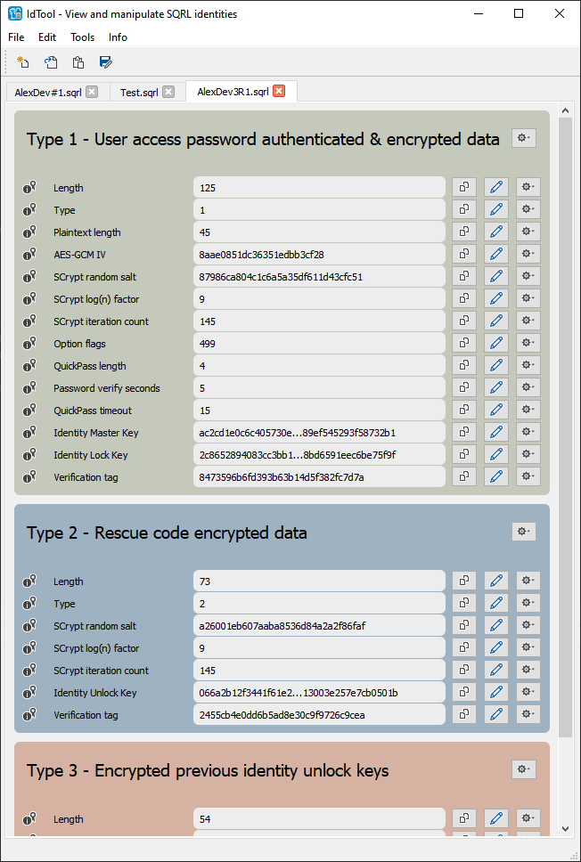

# IdTool
A utility for viewing and manipulating SQRL identities.



## Features

### Visual representation of SQRL identities
SQRL employs its own binary identity storage format called "S4". While being lightweight, compact and extensible, S4 binary data is not readily human-readable, unlike alternative formats such as Json and Xml. This makes it hard for users and developers alike to quickly check the contents of a SQRL identity stored in the S4 data format.

IdTool shows a nice visual representation of each of the identity's binary blocks and allows for a quick inspection of the values encoded within the identity.

### Diffing of SQRL identities
IdTool lets you visually compare the (encrypted and unencrypted) contents of two identities and makes it easy to dertermine whether two identities are related.

### Manipulation of identity files
IdTool lets the user 
* change identity settings (authenticated)
* change all values encoded within the S4 container (unauthenticated)
* add and delete identity blocks (unauthenticated)
* rearrange identity blocks (unauthenticated)

... and finally save the modified data back to disk.
 (!!! All of the changes marked with "unauthenticated" need to be enabled in the "Edit" menu and are carried out without re-encrypting or re-authenticating the identity data !!!) This makes it possible to create "rogue" identity files, which can be useful for hardening the parsing code of any SQRL client application.

### Testing of client-side cryptographic operations
IdTool can perform the following identity-related cryptographic operations:
* Decrypt identity keys
  * IMK+ILK (block type 1)
  * IUK (block type 2)
  * Previous IUKs (block type 3)
* Create site-specific identity keys

### Parsing of custom identity blocks
IdTool does not employ simple static parsing of the S4 format. 

Instead, it uses **json templates** for dynamically parsing identity blocks. IdTool comes with pre-built json templates for all currently known block types (Types 1, 2 and 3).

This approach makes it possible to parse and display custom identity block types only by supplying the corresponding json template.

This is an example of how such a template looks like:
```json
{
  "block_type": 99,
  "description": "Add a nice description of your block type",
  "color": "rgb(252, 238, 199)",
  "items": [
    {
      "name": "Length",
      "description": "Inclusive length of the entire outer block",
      "type": "UINT_16",
      "bytes": 2
    },
    {
      "name": "Type",
      "description": "Block type",
      "type": "UINT_16",
      "bytes": 2
    },
    {
      "name": "Your own custom block item",
      "description": "Give a useful description",
      "type": "BYTE_ARRAY",
      "bytes": 32
    },
	...
  ]
}
```

If you are interested in creating your own block templates, I recommend to look at the standard templates provided with the app (within the _blockdev/_ subdirectory) to get a sense for how data types, repitition and dynamic item lengths are handled.


## Platforms
IdTool was written in platform neutral C++ using the [Qt Framework](https://www.qt.io) and it should therefore be possible to compile it for all platforms supported by the Qt framework. Among those are the Windows, Linux and MacOS.

IdTool is currently being developed and tested on Windows but should currently also build and run on Linux.

Build instructions for Linux (tested on Ubuntu 18.04 and 19.10 minimal desktop version):
(IMPORTANT  :  Ubuntu  versions  prior  to  18.04  are  **not**  supported,  becuase  IdTool  requires QT  Version  5.9.5,  and  GLIBC  above  version  2.25).

```
sudo apt update && sudo apt upgrade -y
sudo apt autoremove
sudo apt-get install git
sudo apt-get install qtcreator qt5-default build-essential

mkdir ~/src
cd ~/src
git clone https://github.com/sqrldev/IdTool IdTool
cd IdTool
qmake IdTool.pro
make
./IdTool
```

Any help with testing it on other platforms is highly appreciated.

## Collaboration
I invite everyone willing to contribute to do so by either helping with further development/posting PRs, or simply finding and reporting bugs using the issue tracker.
